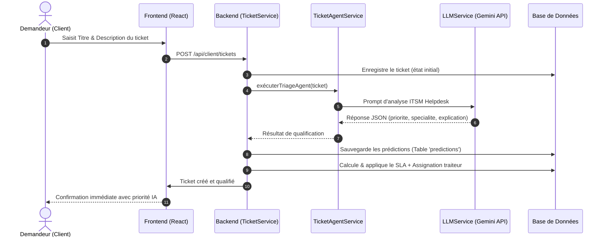

# 🛠️ Intervention Manager (IntervManager)

Application complète de gestion et de suivi des interventions techniques et tickets de support, propulsée par un **Agent IA / LLM (Google Gemini)** et conçue avec une architecture découplée **Backend (Laravel)** et **Frontend (React + Vite)**.

---

## 📌 Sommaire

- [Présentation](#-présentation)
- [🤖 Intégration LLM & Intelligence Artificielle](#-intégration-llm--intelligence-artificielle)
  - [1. Rôle du LLM dans l'Application](#1-rôle-du-llm-dans-lapplication)
  - [2. Fonctionnement Technique](#2-fonctionnement-technique)
  - [3. Intégration dans l'Expérience Utilisateur (UI)](#3-intégration-dans-lexpérience-utilisateur-ui)
- [Fonctionnalités Principales](#-fonctionnalités-principales)
- [Architecture & Structure du Projet](#-architecture--structure-du-projet)
- [Stack Technique](#-stack-technique)
- [Prérequis](#-prérequis)
- [Installation & Démarrage](#-installation--démarrage)
  - [1. Backend (Laravel)](#1-backend-laravel)
  - [2. Frontend (React + Vite)](#2-frontend-react--vite)
- [Variables d'Environnement Clés](#-variables-denvironnement-clés)
- [Commandes Utiles](#-commandes-utiles)
- [Aperçu de l'API](#-aperçu-de-lapi)
- [Licence](#-licence)

---

## 📖 Présentation

**Intervention Manager** optimise et automatise le cycle de vie du support technique au sein d'une organisation. Dès la soumission d'une demande, un **Agent IA (LLM)** analyse le contenu de l'incident pour qualifier sa criticité, déterminer le domaine de compétence requis, calculer les échéances de service (SLA) et assigner automatiquement l'intervention au bon intervenant.

L'application articule son flux opérationnel autour de trois rôles :
1. **Demandeur (Client)** : Déclare et suit ses incidents ou demandes d'intervention.
2. **Traiteur (Technicien)** : Reçoit les tickets qualifiés par l'IA, utilise les diagnostics suggérés, résout l'intervention ou l'escalade.
3. **Gestionnaire (Administrateur)** : Supervise les KPIs globaux, surveille la précision du modèle IA, gère les utilisateurs et configure les politiques SLA.

---

## 🤖 Intégration LLM & Intelligence Artificielle

L'application embarque un agent autonome d'aide à la décision et de dispatching basé sur un grand modèle de langage (**LLM**).

### 1. Rôle du LLM dans l'Application

L'agent IA (`TicketAgentService`) intervient dès la création d'un ticket par un utilisateur et réalise une analyse technique approfondie :

- 🎯 **Triage & Classification de la Priorité** :
  L'IA évalue l'impact métier décrit par l'utilisateur et assigne une sévérité stricte selon des règles ITSM :
  - **Critique** : Incident majeur paralysant l'activité ou un service de production clé.
  - **Haute** : Incident bloquant l'activité d'un utilisateur sans solution de contournement.
  - **Moyenne** : Incident perturbateur avec solution palliative existante.
  - **Basse** : Demande d'information, suggestion ou anomalie cosmétique.

- 🧭 **Détection de la Spécialité & Routage Intelligent** :
  Le modèle analyse les symptômes techniques pour diriger le ticket vers le pôle de compétences adéquat :
  - *Infrastructure* (Serveurs, Cloud, Virtualisation, Active Directory, Sauvegardes).
  - *Support Client* (Bureautique, configuration logicielle, messagerie Outlook).
  - *Réseau* (Wi-Fi, VPN, Switch, Firewall, connectivité).
  - *Sécurité* (Tentatives de phishing, malware, compromission d'accès).
  - *Applications Métiers* (ERP, Sage, CRM, logiciels de paie).
  - *Matériel* (Pannes physiques, postes, imprimantes, écrans).
  - *Industriel & Maintenance* (Électrique, Mécanique, Instrumentation & Contrôle, Procédés de production, Logistique & Manutention).

- ⏱️ **Calcul Dynamique du SLA** :
  La priorité calculée par le LLM est automatiquement couplée au moteur de règles SLA pour fixer la date/heure limite d'intervention et de résolution.

- 🤝 **Dispatching & Assignation Automatique** :
  Le système interroge le vivier de techniciens disponibles (`est_actif = true`, `est_disponible = true`) ayant la spécialité identifiée par le LLM et assigne automatiquement le ticket.

- 💡 **Explication & Justification Contextuelle** :
  L'IA formule une synthèse expliquant son raisonnement, facilitant ainsi la compréhension immédiate par le technicien.

### 2. Fonctionnement Technique



- **Fournisseur & Modèle** : Google Gemini via `generativelanguage.googleapis.com` (modèle configurable : `gemini-flash-latest`).
- **Déterminisme & Sécurité** : `temperature = 0.1` et mode `responseMimeType: application/json` pour garantir une réponse structurée et exploitable par le backend.
- **Résilience & Fallback** :
  - Retry automatique (jusqu'à 3 tentatives).
  - Réparation automatique des flux JSON tronqués.
  - Stratégie de repli (`fallbackDefault`) garantissant la création du ticket même en cas de coupure du réseau ou de l'API distante.
- **Auditabilité** : Chaque prédiction d'IA est historisée dans la table `predictions` avec la cible (`Priorite`, `Traiteur`, `SLA`), la valeur prédite et le score de confiance.

### 3. Intégration dans l'Expérience Utilisateur (UI)

- **Côté Demandeur** : Lors de la soumission d'une demande, un indicateur d'analyse en temps réel (*"Calcul IA & Envoi..."*) s'affiche, puis la priorité attribuée par l'IA est visible sur le suivi du ticket.
- **Côté Traiteur** : Dans l'espace de résolution (`TicketResolve`), un encadré **"Analyse & Suggestions de l'IA SmartSupport"** présente la synthèse prédictive, le degré de confiance et les recommandations pour accélérer le dépannage.
- **Côté Gestionnaire** : Le tableau de bord superviseur intègre un widget **"Précision Modèle IA"** calculé sur les prédictions et l'adéquation des résolutions.

---

## ✨ Fonctionnalités Principales

### 👤 Espace Demandeur
- Tableau de bord personnalisé avec indicateurs clés (tickets en cours, résolus, en attente).
- Création simplifiée avec qualification instantanée par l'Agent IA.
- Consultation de l'historique et suivi du statut des demandes.
- Fil de discussion / commentaires en temps réel sur chaque ticket.

### 🔧 Espace Traiteur (Technicien)
- Boîte de réception personnelle (`Inbox`) des tickets auto-assignés par l'IA selon la spécialité.
- Interface de résolution dédiée : diagnostic IA, notes techniques, clôture du ticket, échange direct.
- Système d'**escalade** de tickets vers des collègues avec transfert de compétences.
- Statistiques personnelles de traitement et performance technique.

### 📊 Espace Gestionnaire (Manager / Admin)
- Dashboard global avec KPIs opérationnels (taux de résolution, respect SLA, charge de travail, précision IA).
- Supervision globale de l'ensemble des tickets du système.
- Gestion des utilisateurs : activation/désactivation de comptes, création de comptes techniciens avec spécialités.
- Configuration et personnalisation des politiques **SLA** (délais de prise en charge et de résolution).

---

## 📁 Architecture & Structure du Projet

```text
IntervManager/
├── backend/                  # Application Backend (API REST Laravel)
│   ├── app/
│   │   ├── Http/Controllers/ # Contrôleurs (Auth, Ticket, Gestionnaire, Traiteur...)
│   │   ├── Models/           # Modèles Eloquent (Ticket, User, Sla, Prediction...)
│   │   ├── Services/         # Logique métier et agents IA
│   │   │   ├── LLMService.php          # Communication HTTP avec l'API Gemini
│   │   │   ├── TicketAgentService.php  # Agent IA expert en triage ITSM
│   │   │   ├── AutomationService.php   # Moteur de règles d'automatisation
│   │   │   └── TicketService.php       # Orchestration du cycle de vie des tickets
│   │   └── Middleware/       # Middlewares d'autorisation et rôles (JWT, RoleMiddleware)
│   ├── config/               # Fichiers de configuration
│   ├── database/
│   │   ├── migrations/       # Schémas de base de données (tickets, predictions, slas...)
│   │   └── seeders/          # Données initiales (SLA, Traiteurs, Workflow...)
│   ├── routes/
│   │   └── api.php           # Définition des endpoints REST sécurisés par JWT
│   └── composer.json         # Dépendances et scripts PHP
│
├── Front-end/                # Application Frontend (SPA React)
│   ├── public/               # Ressources statiques (favicon, icônes SVG)
│   ├── src/
│   │   ├── components/       # Composants réutilisables (Navbar, Sidebar, Modals...)
│   │   ├── contexts/         # Contextes React (AuthContext...)
│   │   ├── layouts/          # Gabarits de mise en page
│   │   ├── pages/            # Vues organisées par profil
│   │   │   ├── demandeur/    # ClientDashboard, CreateTicket, TicketsList, TicketDetail
│   │   │   ├── Traiteur/     # TechDashboard, TicketInbox, TicketResolve (bloc IA), EscaladeTicket
│   │   │   ├── gestionnaire/ # GestionnaireDashboard (KPI IA), UserManagement, SlaConfig...
│   │   │   ├── public/       # Home, Login, SignUp
│   │   │   └── shared/       # Profile...
│   │   ├── services/         # Clients API HTTP (Axios)
│   │   ├── App.jsx           # Définition des routes et protections par rôle
│   │   └── main.jsx          # Point d'entrée de l'application React
│   ├── package.json          # Dépendances et scripts Node.js
│   └── vite.config.js        # Configuration du bundler Vite
│
└── README.md                 # Documentation du projet
```

---

## 💻 Stack Technique

| Domaine | Technologies |
| :--- | :--- |
| **Intelligence Artificielle** | **LLM Google Gemini** (`gemini-flash-latest`), Agent autonome de triage ITSM, Génération JSON contrainte |
| **Backend** | PHP 8.3+, Laravel 12, JWT Auth (`php-open-source-saver/jwt-auth`), Laravel Sanctum |
| **Frontend** | React 19, Vite, Tailwind CSS v4, Lucide React (icônes), React Router DOM v7 |
| **Visualisation** | Recharts (graphiques et statistiques des tableaux de bord) |
| **Base de données** | MySQL / MariaDB (ou SQLite pour tests rapides) |
| **Environnement** | Laragon / XAMPP / Serveur Web local |

---

## ⚙️ Prérequis

Assurez-vous d'avoir installé sur votre machine :
- **PHP** >= 8.3 avec extensions (`pdo_mysql`, `mbstring`, `openssl`, `curl`)
- **Composer** (gestionnaire de paquets PHP)
- **Node.js** >= 18.x & **npm**
- Un serveur MySQL (par exemple via **Laragon**)
- Une clé d'API **Google Gemini** (gratuite sur Google AI Studio)

---

## 🚀 Installation & Démarrage

### 1. Backend (Laravel)

1. Rendez-vous dans le dossier backend :
   ```bash
   cd backend
   ```

2. Installez les dépendances Composer :
   ```bash
   composer install
   ```

3. Configurez les variables d'environnement :
   ```bash
   cp .env.example .env
   ```
   *Renseignez vos accès à la base de données et votre clé API Gemini dans le fichier `.env`.*

4. Générez la clé d'application et la clé JWT :
   ```bash
   php artisan key:generate
   php artisan jwt:secret
   ```

5. Exécutez les migrations et les seeders :
   ```bash
   php artisan migrate --seed
   ```

6. Lancez le serveur local :
   ```bash
   php artisan serve
   ```
   *L'API sera disponible sur `http://127.0.0.1:8000`.*

---

### 2. Frontend (React + Vite)

1. Rendez-vous dans le dossier frontend :
   ```bash
   cd Front-end
   ```

2. Installez les dépendances npm :
   ```bash
   npm install
   ```

3. Démarrez le serveur de développement :
   ```bash
   npm run dev
   ```
   *L'application web sera disponible sur `http://localhost:5173`.*

---

## 🔑 Variables d'Environnement Clés (Backend `.env`)

```ini
# Base de données
DB_CONNECTION=mysql
DB_HOST=127.0.0.1
DB_PORT=3306
DB_DATABASE=intervmanager
DB_USERNAME=root
DB_PASSWORD=

# Sécurité JWT
JWT_SECRET=votre_cle_jwt_generee

# Intelligence Artificielle (Google Gemini)
GEMINI_API_KEY=votre_cle_api_google_gemini
GEMINI_MODEL=gemini-flash-latest
```

---

## ⚡ Commandes Utiles

### Backend

| Commande | Description |
| :--- | :--- |
| `php artisan serve` | Lance le serveur local Laravel |
| `php artisan migrate` | Applique les migrations |
| `php artisan migrate:fresh --seed` | Réinitialise la base et charge les seeders |
| `php artisan route:list` | Affiche toutes les routes déclarées |
| `php artisan test` | Exécute la suite de tests unitaires et fonctionnels |

### Frontend

| Commande | Description |
| :--- | :--- |
| `npm run dev` | Lance le serveur de développement local avec rechargement à chaud (HMR) |
| `npm run build` | Compile l'application pour la production dans le dossier `dist/` |
| `npm run preview` | Prévisualise localement le build de production |
| `npm run lint` | Lance la vérification ESLint du code |

---

## 🔌 Aperçu de l'API

### Authentification publique
- `POST /api/register` : Inscription d'un nouvel utilisateur
- `POST /api/login` : Connexion et récupération du JWT
- `POST /api/logout` : Déconnexion
- `GET /api/me` : Données de l'utilisateur connecté

### Espace Demandeur (`role:demandeur`)
- `GET /api/client/dashboard` : Données agrégées du dashboard client
- `GET /api/client/tickets` : Liste des tickets créés par le client
- `POST /api/client/tickets` : Création d'un ticket avec qualification automatique par le LLM
- `GET /api/client/tickets/{id}` : Consultation détaillée d'un ticket
- `GET|POST /api/client/tickets/{id}/commentaires` : Liste et ajout de commentaires

### Espace Traiteur (`role:traiteur`)
- `GET /api/traiteur/dashboard-stats` : Métriques du tableau de bord technicien
- `GET /api/traiteur/inbox` : Tickets assignés en attente
- `GET /api/traiteur/tickets/{id}` : Détails pour résolution avec notes de diagnostic IA
- `POST /api/traiteur/tickets/{id}/resolve` : Clôture et résolution du ticket
- `POST /api/traiteur/escalader` : Escalade du ticket à un autre technicien

### Espace Gestionnaire (`role:gestionnaire`)
- `GET /api/gestionnaire/dashboard-stats` : KPIs du centre de support et précision de l'IA
- `GET /api/gestionnaire/tickets` : Vue exhaustive de tous les tickets
- `GET /api/gestionnaire/utilisateurs` : Liste des utilisateurs
- `PATCH /api/gestionnaire/utilisateurs/{id}/toggle-status` : Activer/Désactiver un compte
- `POST /api/gestionnaire/utilisateurs/traiteurs` : Créer un compte technicien
- `GET|PUT /api/gestionnaire/sla` : Consultation et modification des règles SLA

---

## 📄 Licence

Ce projet est sous licence [MIT](LICENSE).
